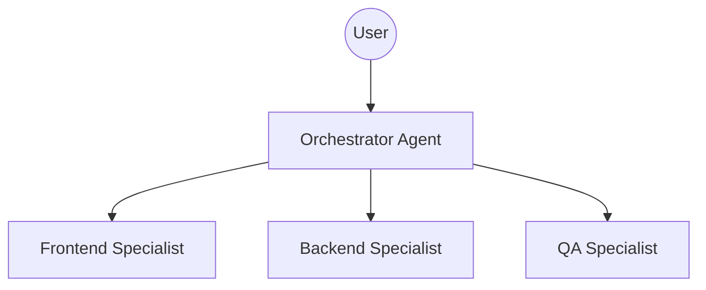

# Agent Topology: Hierarchical (Manager-Worker)

Use this topology for complex projects where a single Orchestrator delegates tasks to specialized Sub-Agents.

## Structure

## Roles

### Orchestrator (Manager)
- **Responsibility**: Decompose tasks, route to specialists, synthesize results.
- **Tools**: `read_file`, `notify_user` (for clarification), `delegate_task` (conceptual).
- **Personality**: Strategic, high-level planner.

### Specialists (Workers)
- **Frontend**: React/Vue expert. Focus on UI/UX components.
- **Backend**: API/DB expert. Focus on logic and data.
- **QA**: Testing expert. Validates changes against requirements.

## Implementation Steps

1. **Define the Orchestrator**: Create `Orchestrator/AGENT.md`.
2. **Define Specialists**: Create `Specialist/AGENT.md` for each domain.
3. **Establish Protocol**: Define how agents communicate (e.g., via shared `task.md` or explicit handoffs).

## Usage Example

> User: "Add a login feature."
>
> 1. Orchestrator analyzes request.
> 2. Orchestrator assigns DB schema changes to **Backend**.
> 3. Orchestrator assigns Login Form UI to **Frontend**.
> 4. Specialists report completion.
> 5. Orchestrator asks **QA** to verify.
> 6. Orchestrator reports success to User.
