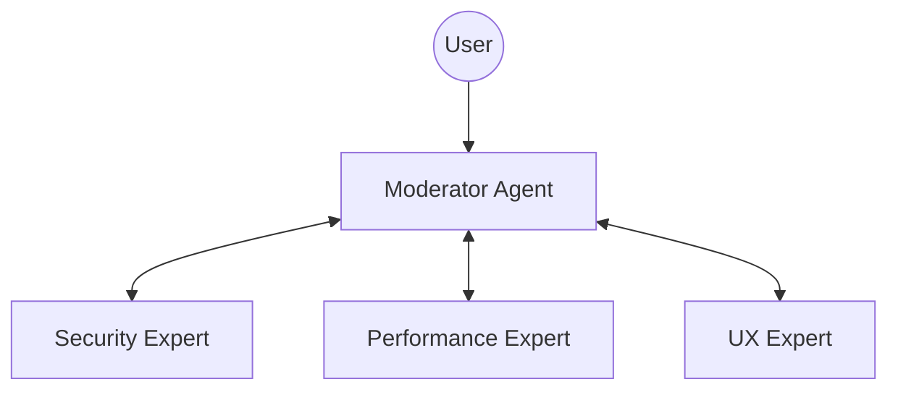

# Agent Topology: Expert Panel (Collaborative)

Use this topology when you need diverse perspectives to solve a problem or design a system.

## Structure

## Roles

### Moderator (Facilitator)
- **Responsibility**: Present the problem, solicit opinions, synthesize consensus.
- **Personality**: Neutral, objective, synthesizer.

### Experts (Panelists)
- **Security Expert**: Focuses on vulnerabilities, auth, encryption.
- **Performance Expert**: Focuses on latency, throughput, optimization.
- **UX Expert**: Focuses on user journey, accessibility, delight.

## Workflow

1. **Problem Presentation**: User or Moderator defines the challenge.
2. **Round Table**: Each Expert analyzes the problem from their domain.
3. **Debate**: Experts critique each other's proposals (facilitated by Moderator).
4. **Synthesis**: Moderator creates a final unified solution.

## When to Use

- Architecture Design Reviews
- Security Audits
- Complex Refactoring planning
