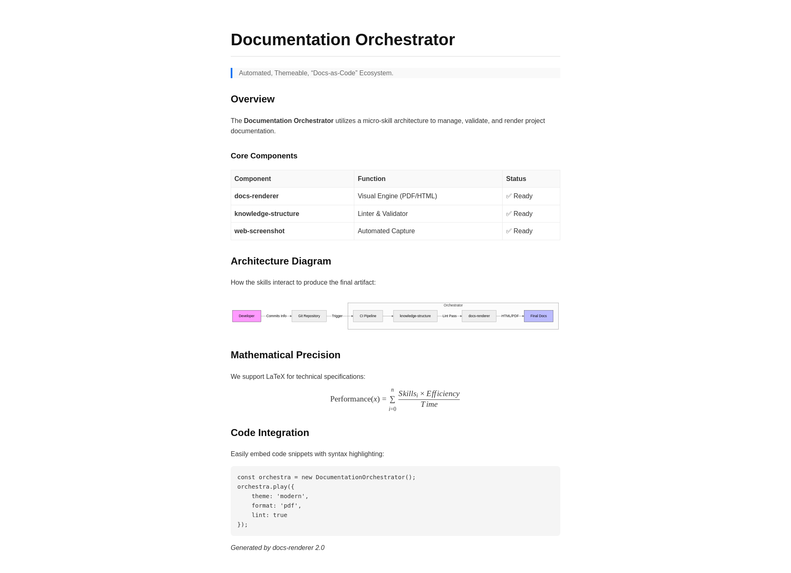
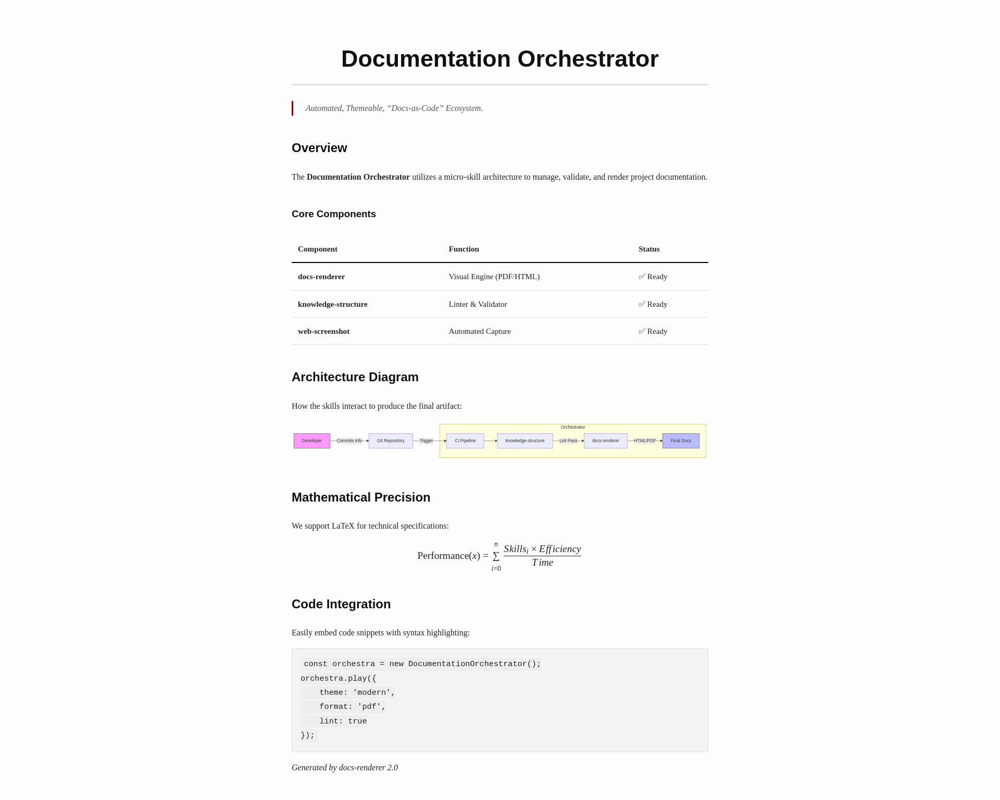
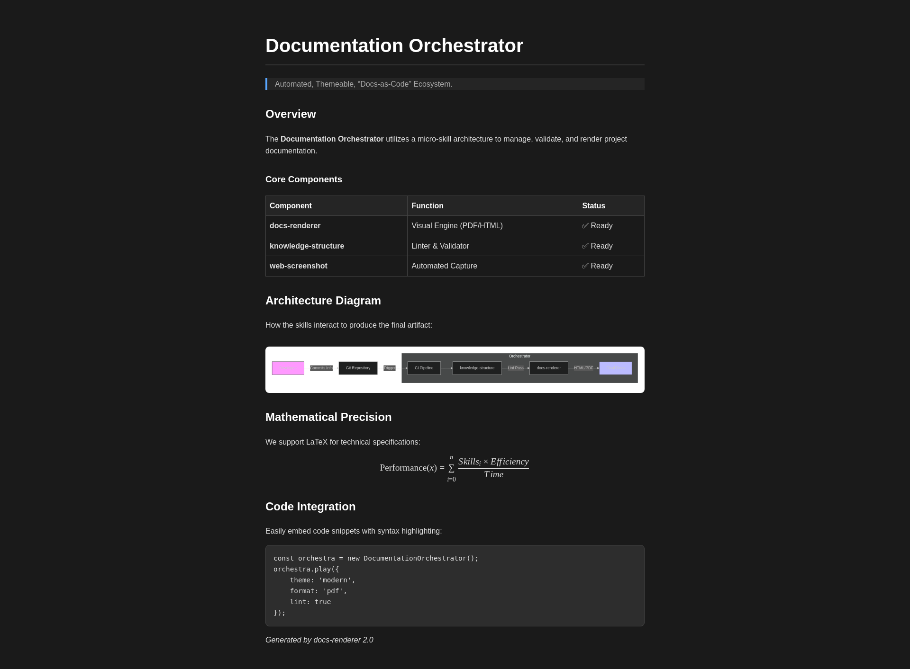

# Theme Gallery

Choose the style that best fits your project.

## Modern (`--theme modern`)
> **Default**. Clean, sans-serif, optimized for digital reading. Blue accents.

---

## Classic (`--theme classic`)
> **Academic**. Serif fonts, maroon accents, traditional book layout. Great for formal papers.

---

## Dark (`--theme dark`)
> **High Contrast**. Dark background, light text. Easy on the eyes for late-night coding.

