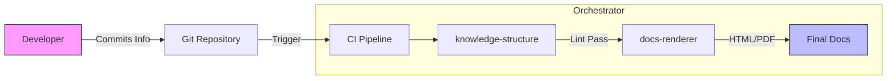

# Documentation Orchestrator
> Automated, Themeable, "Docs-as-Code" Ecosystem.

## Overview
The **Documentation Orchestrator** utilizes a micro-skill architecture to manage, validate, and render project documentation.

### Core Components
| Component | Function | Status |
| :--- | :--- | :--- |
| **docs-renderer** | Visual Engine (PDF/HTML) | ✅ Ready |
| **knowledge-structure** | Linter & Validator | ✅ Ready |
| **web-screenshot** | Automated Capture | ✅ Ready |

## Architecture Diagram
How the skills interact to produce the final artifact:



## Mathematical Precision
We support LaTeX for technical specifications:

$$
\text{Performance}(x) = \sum_{i=0}^{n} \frac{Skills_i \times Efficiency}{Time}
$$

## Code Integration
Easily embed code snippets with syntax highlighting:

```javascript
const orchestra = new DocumentationOrchestrator();
orchestra.play({
    theme: 'modern',
    format: 'pdf',
    lint: true
});
```

*Generated by docs-renderer 2.0*
