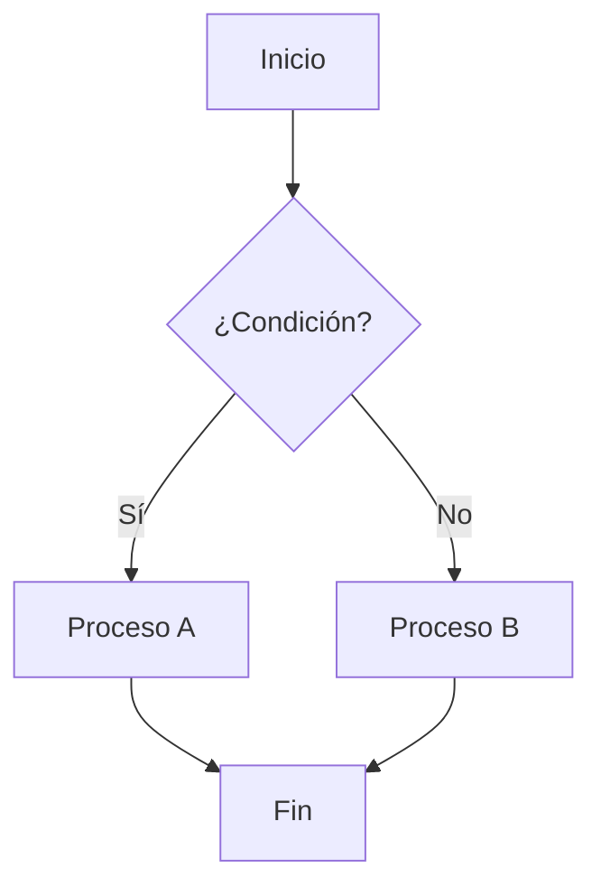
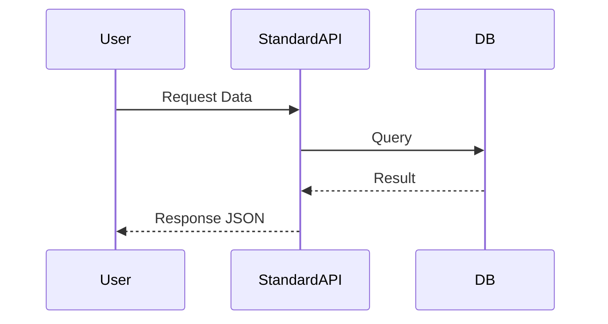
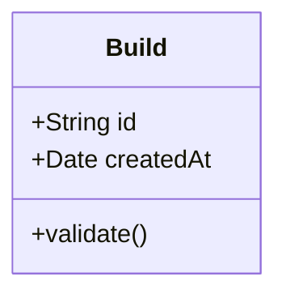
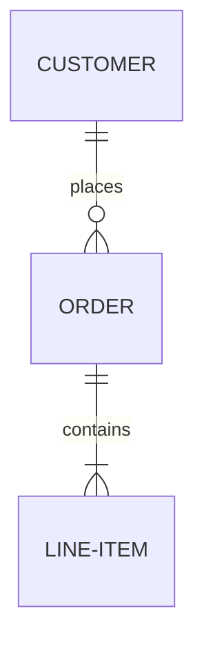

# Ejemplos de Diagramas Mermaid

Este archivo contiene ejemplos de los diagramas Mermaid más utilizados en la documentación del proyecto.

### Flowchart (Flujos de proceso)

### Sequence Diagram (Interacciones API/Servicios)

### Class Diagram (Estructura de Clases)

### ER Diagram (Esquemas de Base de Datos)

