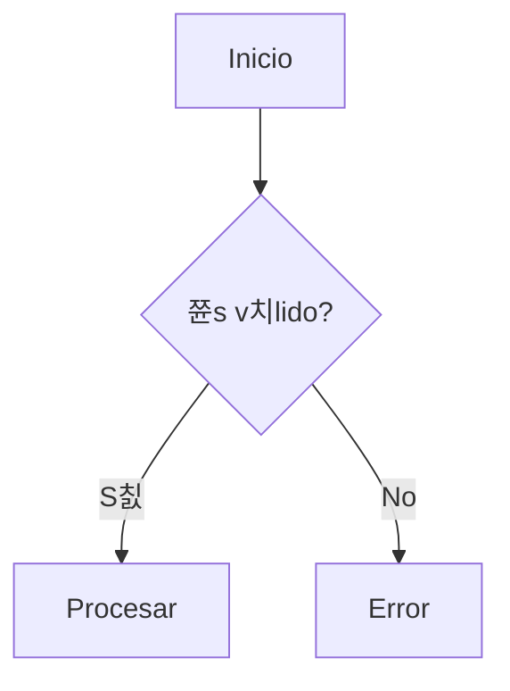

# Mermaid Expert

> "Diagrams as Code. Visuals that live with your repo."

Este skill asiste en la creación de diagramas complejos. No renderiza por sí mismo (eso lo hace `docs-renderer`), sino que ayuda a escribir el código Mermaid correcto.

## 🧠 Capacidades

### 1. Templates de Diagramas
Provee estructuras base para:
- **Flowchart**: Procesos y decisiones.
- **Sequence**: Interacciones de API y Sistemas.
- **Class**: Modelado de dominio.
- **State**: Ciclos de vida de entidades.
- **Gantt**: Cronogramas de proyecto.
- **C4 Model**: Arquitectura de software (Context, Container, Component).

### 2. Theming Advice
Guía sobre cómo aplicar estilos inline o clases CSS para integración con `docs-renderer`.

### 3. Debugging
Ayuda a identificar errores de sintaxis comunes (flechas incorrectas, IDs con espacios, etc.).

---

## Comandos Comunes

No tiene scripts ejecutables complejos, es un skill de **Conocimiento y Recursos**.

### Ver Ejemplos
Explora la base de conocimiento por tipo de diagrama:

```bash
# Flowcharts (Shapes, Styling)
view_file("skills/mermaid-expert/assets/examples/flowchart.md")

# Sequence (Activations, Notes)
view_file("skills/mermaid-expert/assets/examples/sequence.md")

# Technical (Class, State, ER, Gantt, Git, Mindmap)
view_file("skills/mermaid-expert/assets/examples/technical.md")

# C4 Model (Context, Container, Component, Deployment)
view_file("skills/mermaid-expert/assets/examples/c4_model.md")

# Advanced Styling (Neo, HandDrawn, Custom Vars)
view_file("skills/mermaid-expert/assets/examples/styles_and_looks.md")
```

### Cheatsheet & Config
```bash
view_file("skills/mermaid-expert/assets/cheatsheet.md")
```

---

## Patrones de Diseño

### Top-Down vs Left-Right
- Usar `TD` para jerarquías.
- Usar `LR` para líneas de tiempo o procesos paso a paso.

### Identificadores
Usar IDs cortos y texto descriptivo.

