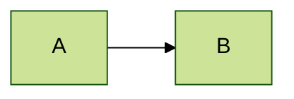

# Mermaid Integration Guide

The `docs-renderer` skill automatically injects Mermaid configurations based on the selected theme.

## Theme Presets

### Modern (`--theme modern`)
- **Style**: Base
- **look**: HandDrawn (simulated via config) or Flat
- **Curves**: Basis (smooth)
- **Colors**: Blue/Slate palette.

### Classic (`--theme classic`)
- **Style**: Neutral
- **Curves**: Linear (straight lines)
- **Font**: Serif
- **Colors**: Monochrome/Grayscale.

### Dark (`--theme dark`)
- **Style**: Dark
- **Curves**: Basis
- **Colors**: High contrast neon/slate.

## Overriding Config
You can customize diagrams using the `%%{init: {...}}%%` directive in your Markdown:

