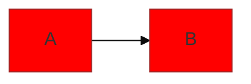

# Mermaid Expert Cheatsheet

Quick reference for configuration, theming, and common issues.

## 1. Directives (Theming)
Inject configuration directly into the diagram.

## 2. Common Config Options
- **look** (New!): `classic`, `neo`, `handDrawn`.
- **theme**: `default`, `forest`, `dark`, `neutral`, `base`.
- **fontFamily**: `"Inter", sans-serif`, `"Merriweather", serif`.
- **logLevel**: `debug`, `info`, `warn`, `error`, `fatal`.
- **securityLevel**: `strict`, `loose`, `antiscript`.
- **startOnLoad**: `true`/`false`.
- **arrowMarkerAbsolute**: `true`/`false`.

## 3. Flowchart Specifics
- **htmlLabels**: `true` (allows HTML in nodes), `false` (SVG only).
- **curve**: `basis` (smooth), `linear` (straight), `step` (90deg), `stepAfter`, `stepBefore`.

## 4. Sequence Specifics
- **actorMargin**: Space between actors (default 50).
- **boxMargin**: Space around participants (default 10).
- **boxTextMargin**: Space between text and box (default 5).
- **noteMargin**: Space around notes (default 10).
- **messageMargin**: Space around messages (default 35).
- **mirrorActors**: Mirror actors at the bottom (default true).
- **bottomMarginAdj**: Adjust bottom margin (default 1).
- **useMaxWidth**: Expand to container width (default true).
- **rightAngles**: Use right angles for lines (default false).

## 5. Troubleshooting (Expert Tips)

### "Syntax Error"
- **Check IDs**: IDs cannot contain spaces unless quoted.
  - ❌ `graph TD; A node-->B;`
  - ✅ `graph TD; A[A node]-->B;`
- **Check Keywords**: `participant`, `actor`, `class`, `state` are reserved.
- **Check Indentation**: Python-style indentation is not required but recommended for readability. Mermaid is line-based.

### "Diagram Cut Off"
- **Use `useMaxWidth`**: Ensure `flowchart: { useMaxWidth: true }` is set in config (default in `docs-renderer`).
- **ViewBox**: If embedding SVG manually, ensure `viewBox` is preserved.

### "Font Issues"
- **Docker**: If running in Docker (`docs-renderer`), ensuring the font is installed in the container is critical. (We use `fonts-liberation` and Google Fonts).
