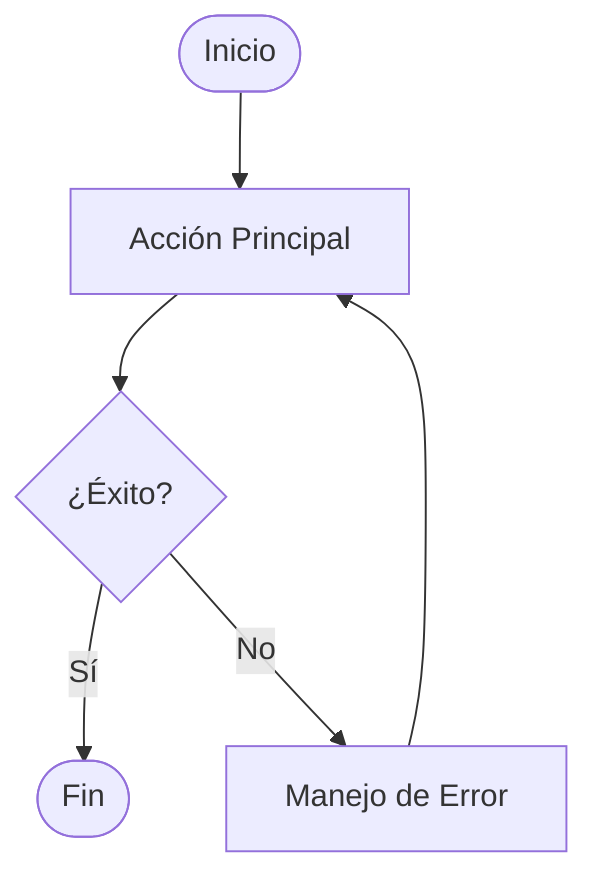
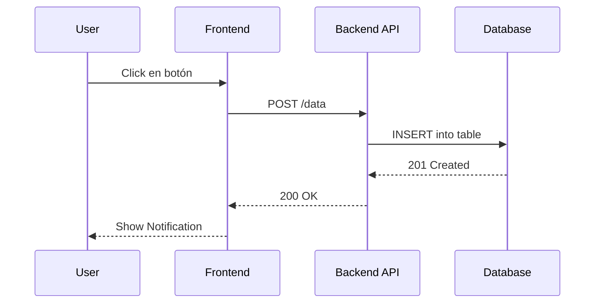
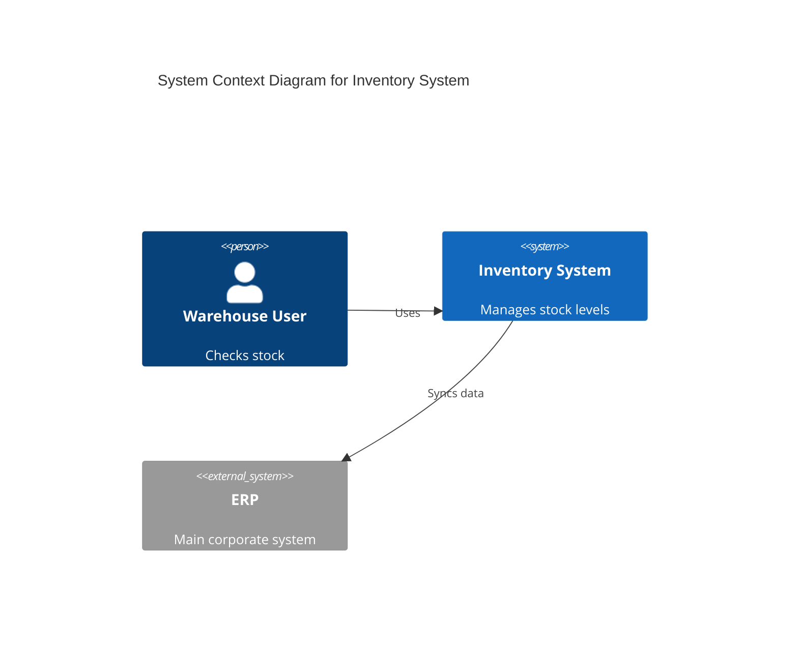
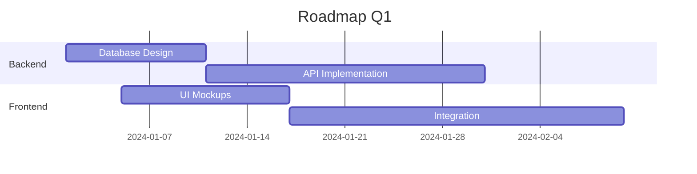

# Mermaid Templates & Examples

## Flowchart (Procesos)

```mermaid
graph TD
    Start([Inicio]) --> Action[Acción Principal]
    Action --> Decision{¿Éxito?}
    Decision -- Sí --> End([Fin])
    Decision -- No --> Error[Manejo de Error]
    Error --> Action
```

## Sequence Diagram (API Calls)

```mermaid
sequenceDiagram
    participant User
    participant FE as Frontend
    participant API as Backend API
    participant DB as Database

    User->>FE: Click en botón
    FE->>API: POST /data
    API->>DB: INSERT into table
    DB-->>API: 201 Created
    API-->>FE: 200 OK
    FE-->>User: Show Notification
```

## C4 Context (Arquitectura)

```mermaid
C4Context
  title System Context Diagram for Inventory System

  Person(user, "Warehouse User", "Checks stock")
  System(system, "Inventory System", "Manages stock levels")
  System_Ext(erp, "ERP", "Main corporate system")

  Rel(user, system, "Uses")
  Rel(system, erp, "Syncs data")
```

## Gantt (Planificación)

```mermaid
gantt
    title Roadmap Q1
    dateFormat  YYYY-MM-DD
    section Backend
    Database Design       :a1, 2024-01-01, 10d
    API Implementation    :after a1  , 20d
    section Frontend
    UI Mockups            :2024-01-05  , 12d
    Integration           : 24d
```
