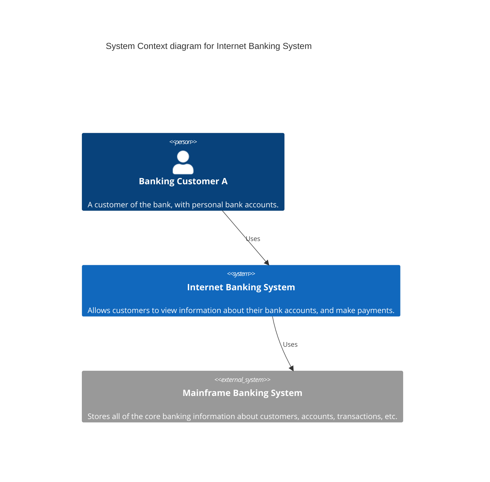
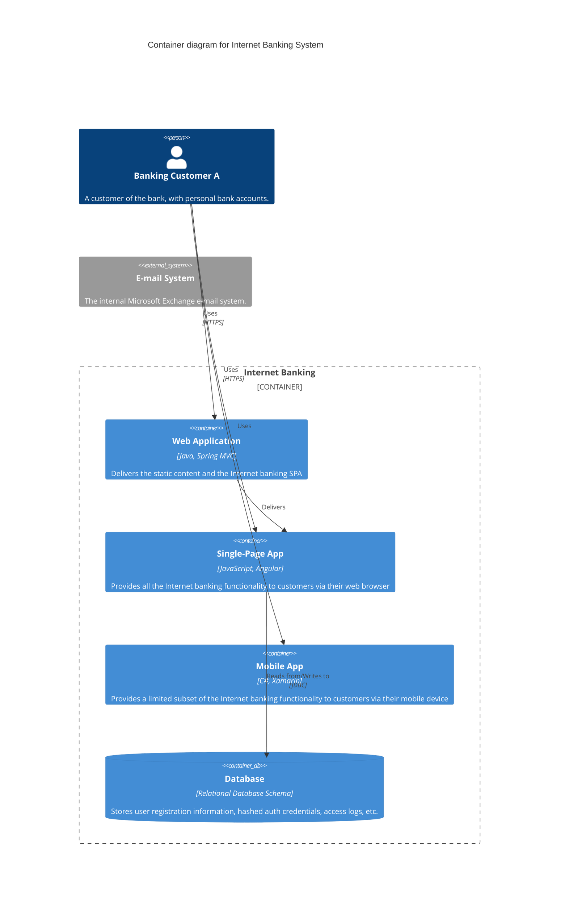
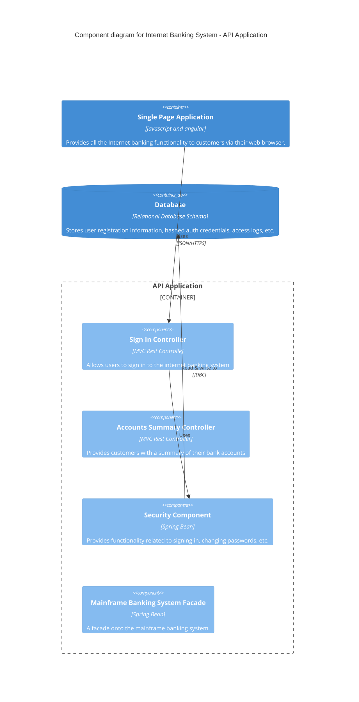
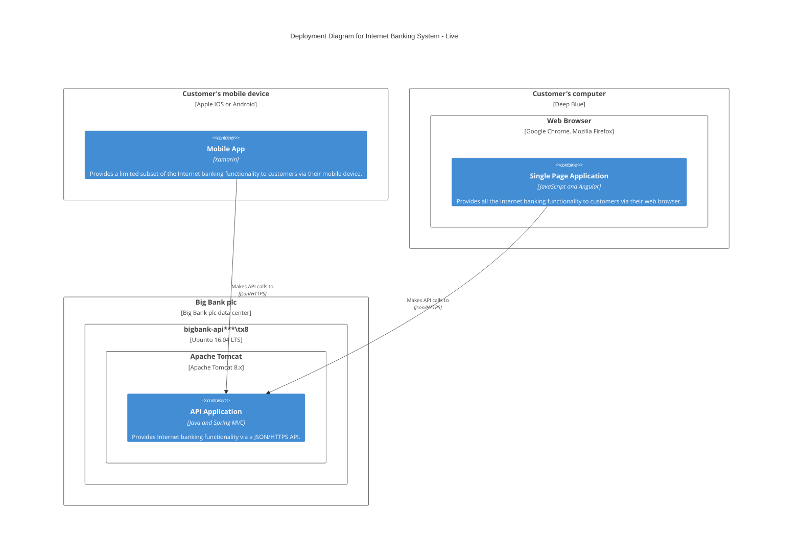
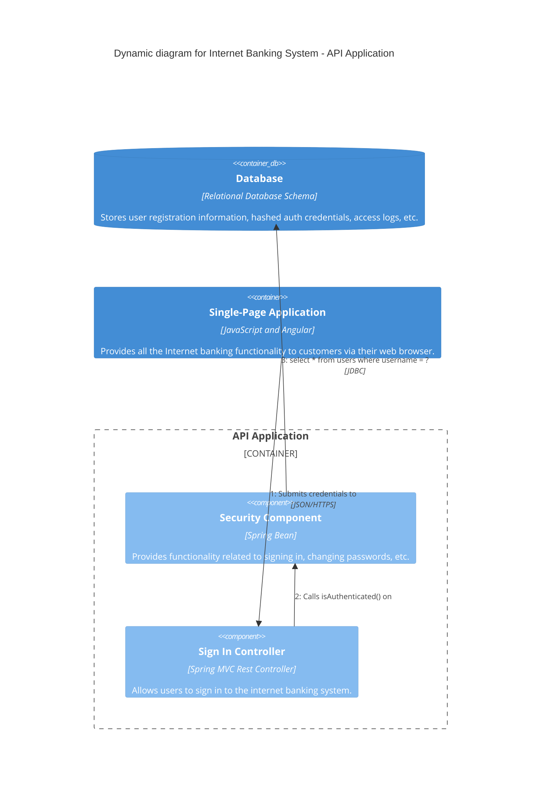

# Mermaid C4 Model Expert Guide

Use C4 diagrams to visualize software architecture at different levels of abstraction.

## 1. System Context (Level 1)
The big picture. How the system fits into the existing IT landscape.

## 2. Container Diagram (Level 2)
Zoom in to the system boundaries. Shows applications, data stores, and microservices.

## 3. Component Diagram (Level 3)
Inside a container. Shows internal components/modules.

## 4. Deployment Diagram
Mapping containers to infrastructure.

## 5. Dynamic Diagram
Runtime view of interactions.

