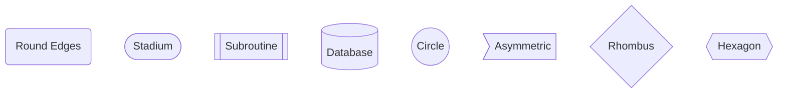
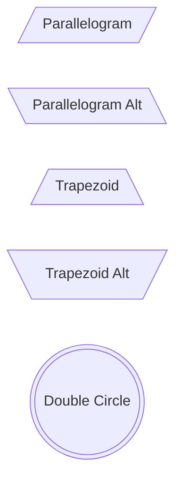
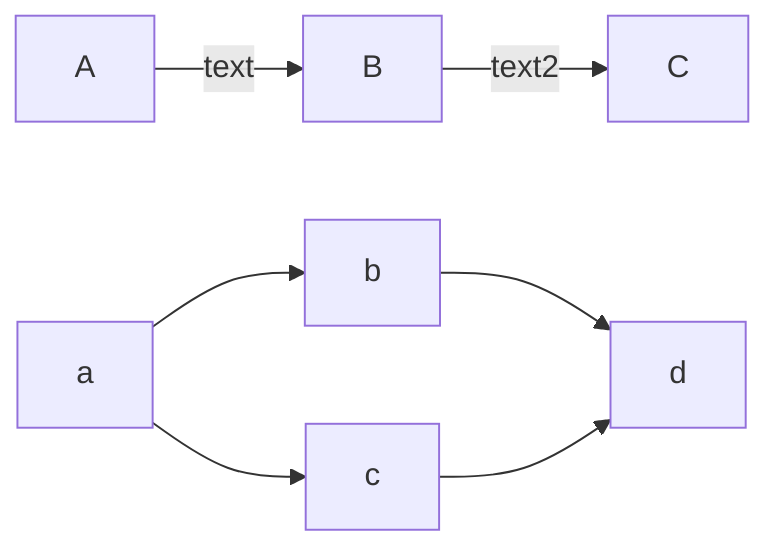
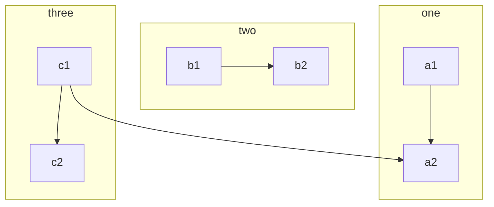
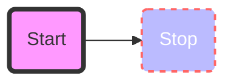
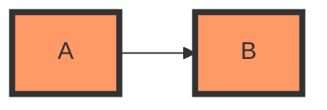
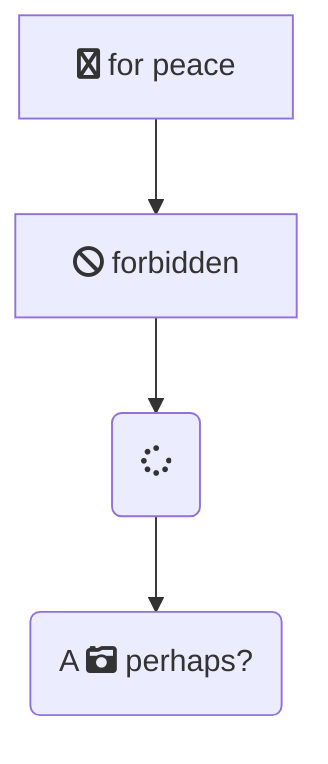
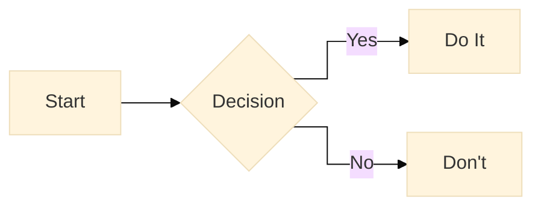

# Mermaid Flowchart Expert Guide

Flowcharts are composed of nodes (geometric shapes) and edges (arrows or lines). The Mermaid code defines how nodes are created and creating links between the nodes.

## 1. Directions
- `TB` - Top to bottom
- `TD` - Top-down/ same as top to bottom
- `BT` - Bottom to top
- `RL` - Right to left
- `LR` - Left to right

## 2. Shapes (Nodes)

### Standard Shapes


### New / Semantic Shapes


## 3. Links (Edges)

### Types of Links
```mermaid
flowchart LR
    A-->B     ::: Link with Arrow Head
    C---D     ::: Open Link
    E--Text-->F ::: Link with Text
    G---|Text|---H ::: Open Link with Text
    I-.->J    ::: Dotted Link
    K==>L     ::: Thick Link
```

### Chaining


## 4. Subgraphs
Group related nodes together.



## 5. EXPERT: Styling & Classes

### Inline Styling


### CSS Classes
Define a class and apply it to multiple nodes.



### FontAwesome Icons
(Requires FontAwesome to be loaded in the renderer)


## 6. Configuration (Directives)
Customize the curve and look directly in the diagram.


