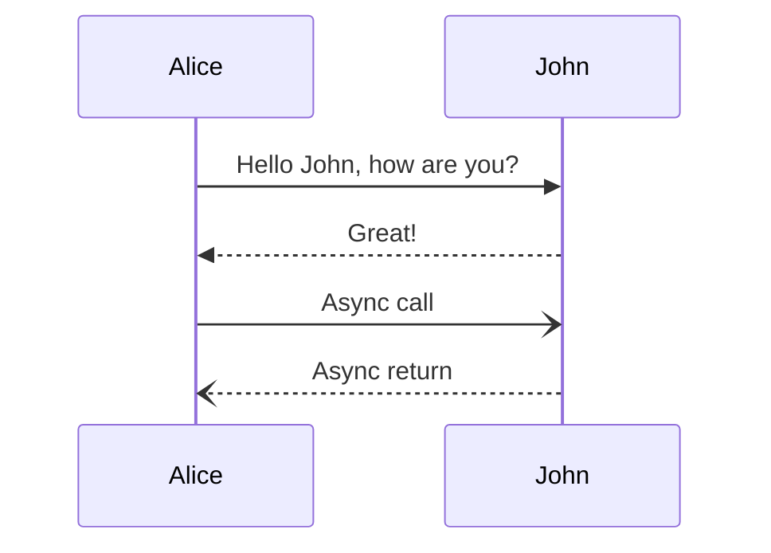
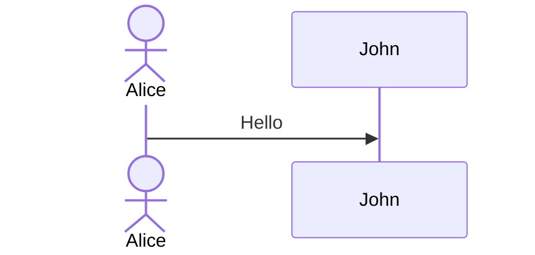
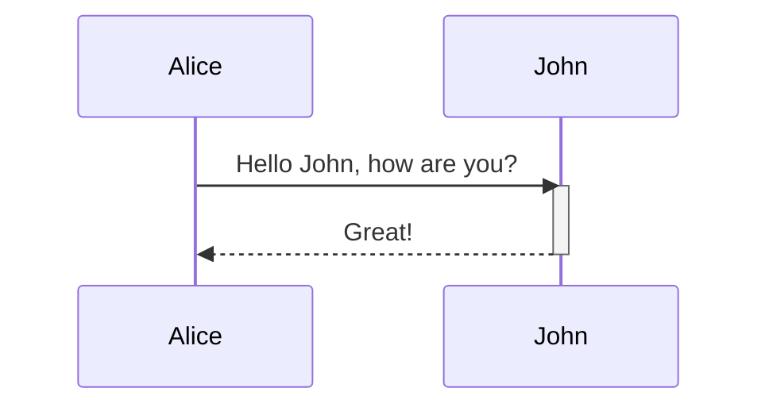
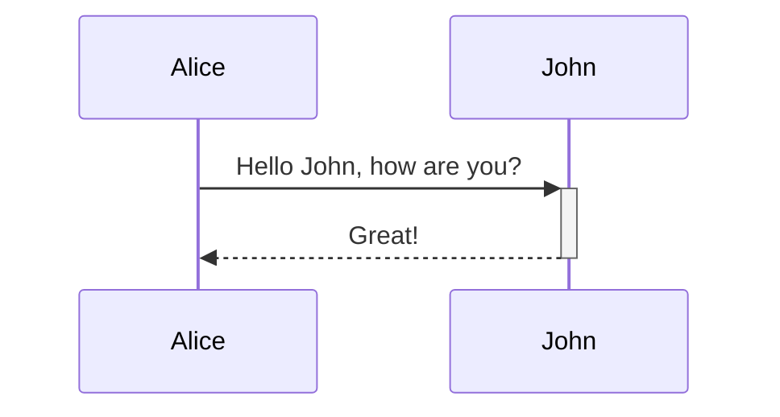
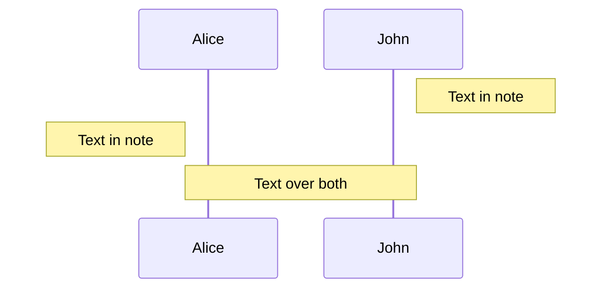
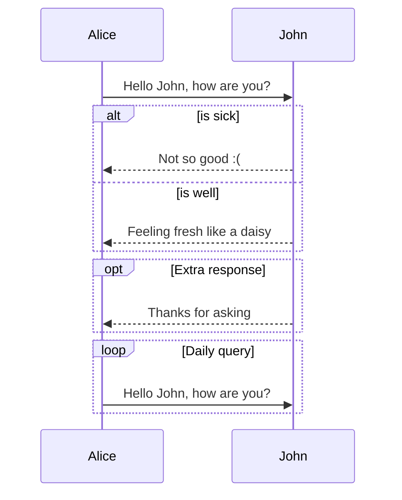
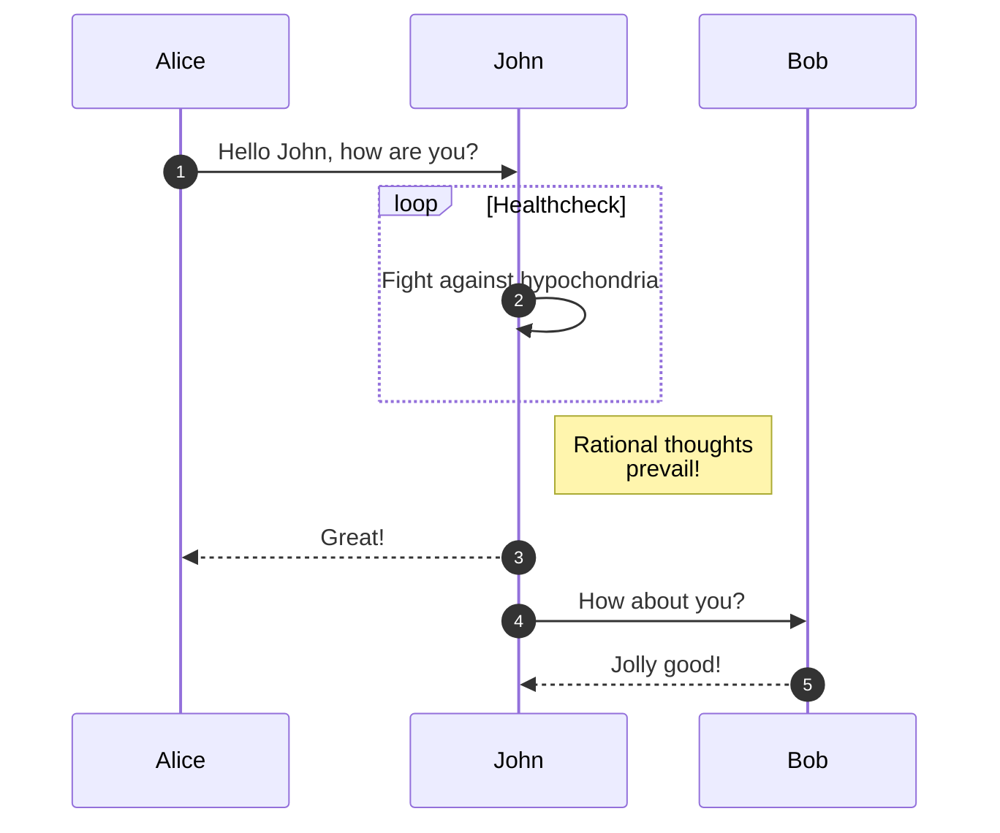
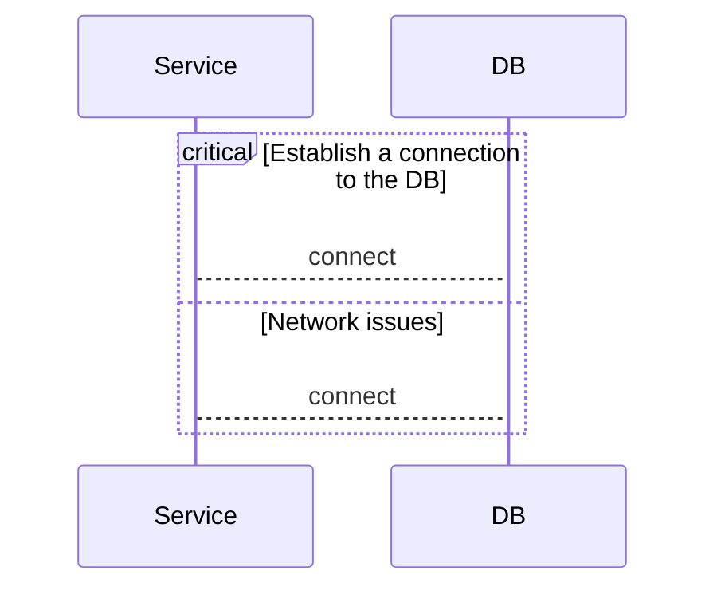
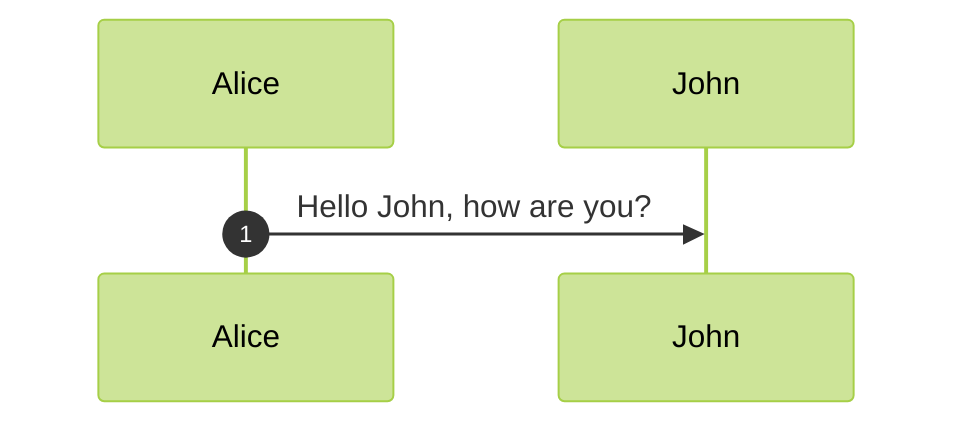

# Mermaid Sequence Diagram Expert Guide

Sequence diagrams are used to show the interaction between actors and objects in a sequential order.

## 1. Basic Syntax

## 2. Participants & Actors
- **Participant**: Rectangular box (default).
- **Actor**: Stick figure.

## 3. Activations
Show when a participant is active/processing.

**Shortcut `+`/`-`**:

## 4. Notes
Add notes to the diagram.

## 5. Loops, Alt, Opt
Logic blocks.

## 6. EXPERT: Messages & Autonumbering

### Autonumber

### Critical Region

## 7. Configuration (Directives)

Customize spacing and actor usage.

