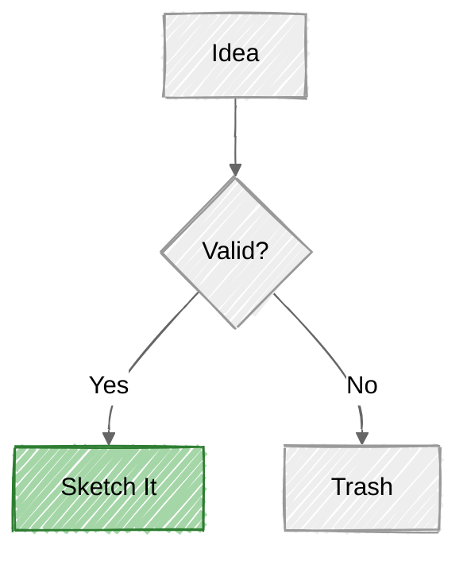
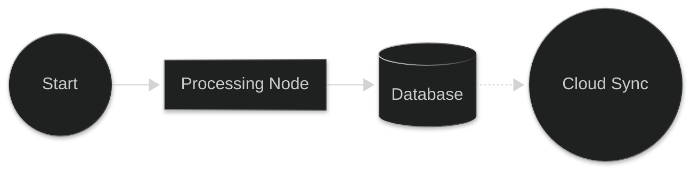
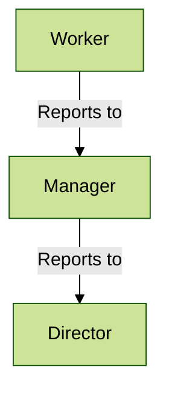
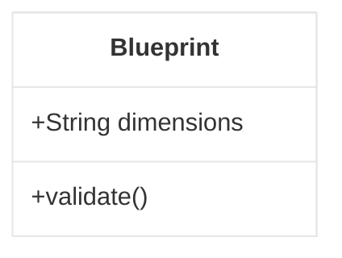
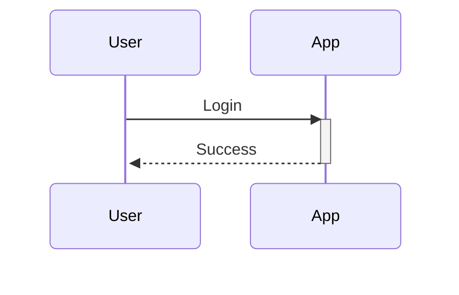

# Mermaid Advanced Styling & Looks

Combine themes, looks, and variables for unique visual styles.

## 1. HandDrawn Sketch (Neutral)
Imitates a rough sketch on sticky notes. Great for brainstorming.

## 2. Neo / Cyberpunk (Dark)
High contrast, neon colors.

## 3. Corporate Clean (Forest)
Professional, clean lines, standard colors.

## 4. Minimalist (Base)
Very simple, high contrast black and white.

## 5. Modern Sequence (Default + Neo)
A modern twist on standard sequence diagrams.

