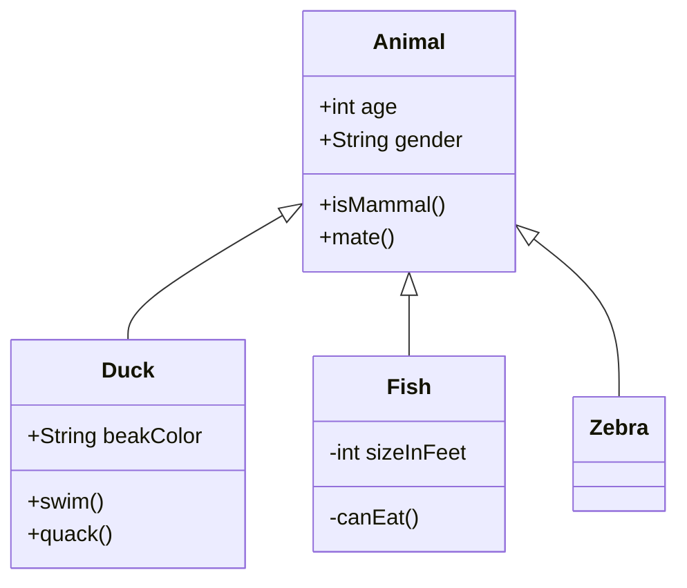
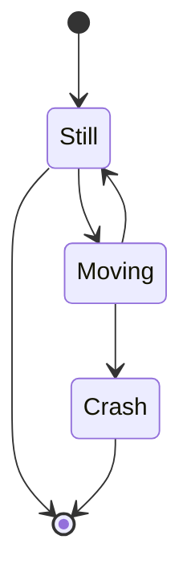
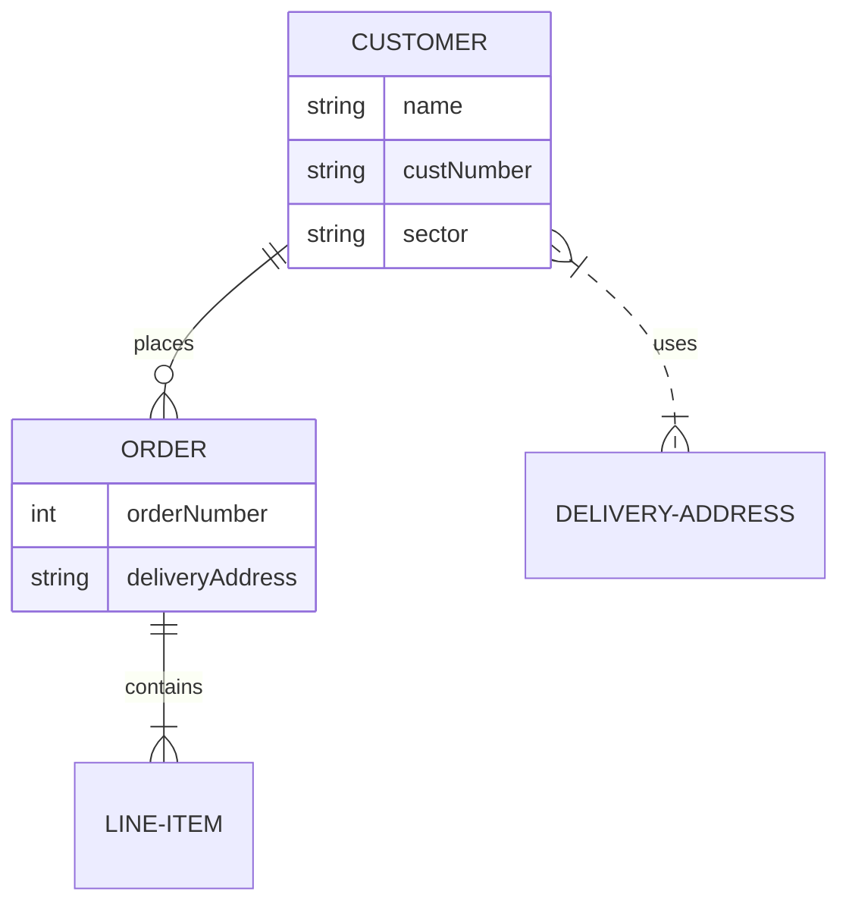
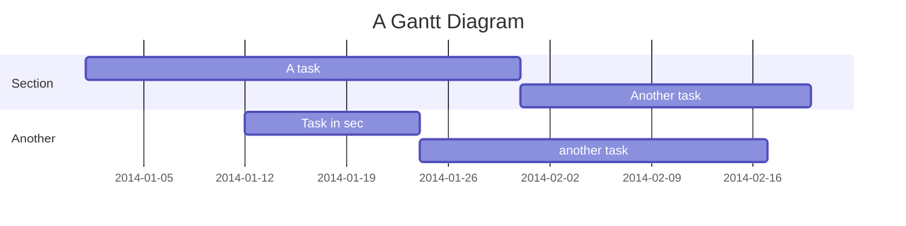
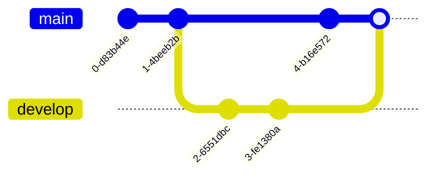
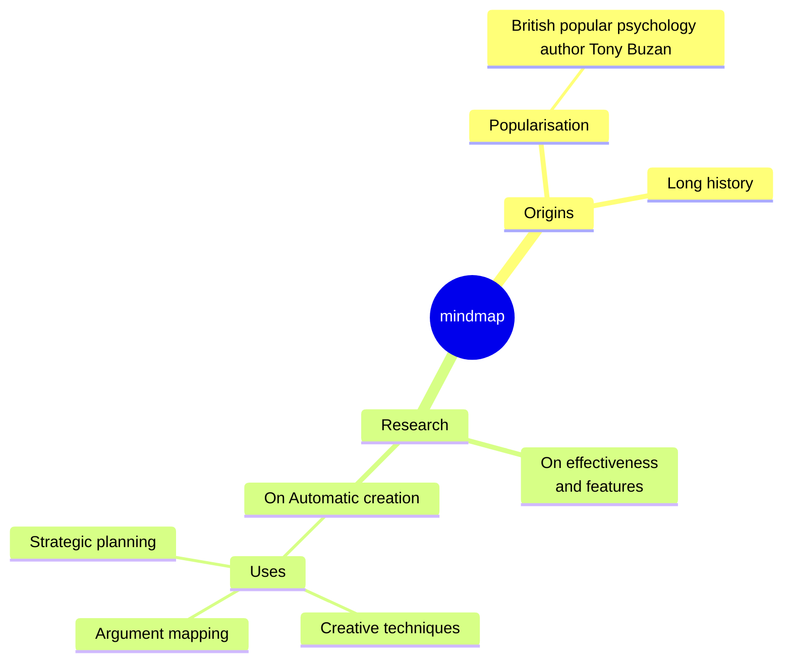
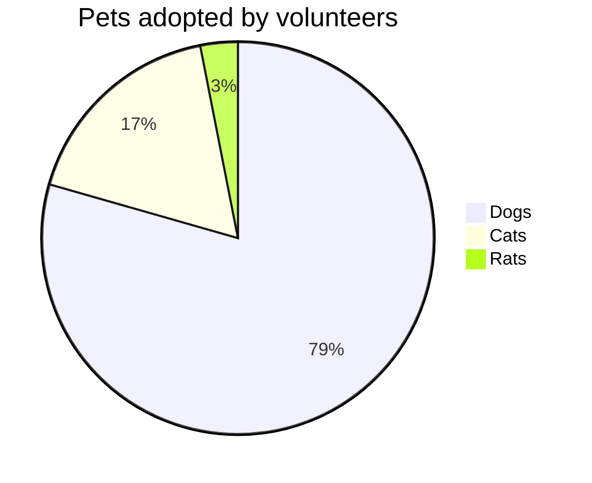

# Mermaid Technical Diagrams Expert Guide

Technical diagrams for architecture and project management.

## 1. Class Diagram
Object Oriented Modeling.

## 2. State Diagram (State Machine)
Finite state machines.

## 3. Entity Relationship (ER) Diagram
Database schema modeling.

## 4. Gantt Chart
Project planning.

## 5. GitGraph
Git history visualization.

## 6. Mindmap
Brainstorming and hierarchy.

## 7. Pie Chart
Simple data visualization.

