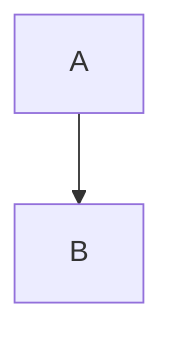

# Math and Diagrams Demo

## 1. LaTeX
$$ E = mc^2 $$

## 2. Mermaid

```mermaid
graph TD; A-->B;
```

## 3. Screenshot
Here is a screenshot taken by `web-screenshot`:

## 4. Links
[[guides/getting-started]] exists now.
